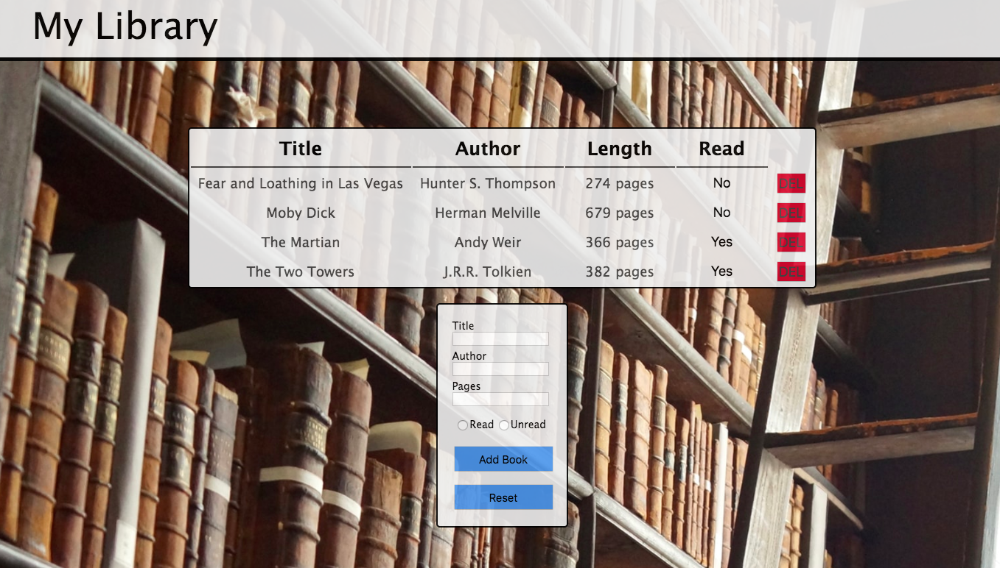

# My Library

## General Information:
This project was complete following The Odin Project's [curriculum](https://www.theodinproject.com/courses/javascript/lessons/library). The purpose was to create an online library where you can keep track of books you've read or want to read.

## Screenshot:

## Technologies:
- HTML
- CSS
- Vanilla Javascript

## Setup: 
The live version of the webpage can be seen [here](https://tpsst5.github.io/pomodoro_timer/).
## Status:
This project is complete.